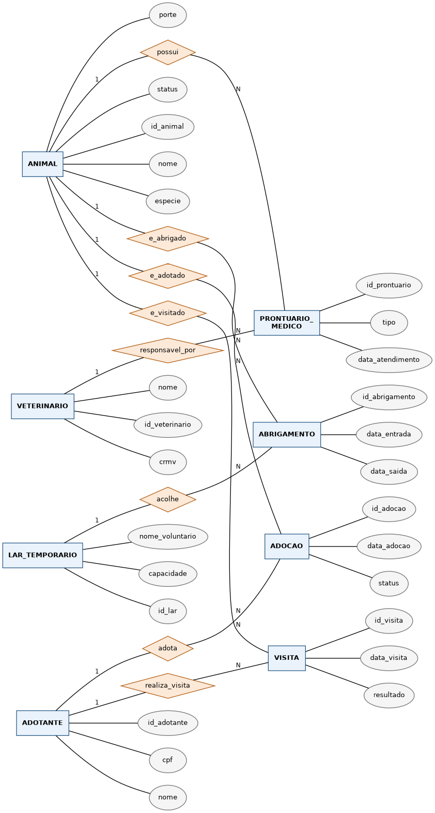

# Etapa 2 — Diagrama Entidade-Relacionamento (Conceitual)

**Ferramenta utilizada:** Graphviz (via script Python `gen_der.py`, incluído
nesta pasta), gerando um diagrama na **notação de Peter Chen**
(entidades = retângulos, relacionamentos = losangos, atributos = elipses,
atributo-chave em elipse destacada).

## Entidades e atributos-chave

| Entidade | Atributo-chave (PK) |
|---|---|
| ANIMAL | id_animal |
| VETERINARIO | id_veterinario |
| PRONTUARIO_MEDICO | id_prontuario |
| LAR_TEMPORARIO | id_lar |
| ABRIGAMENTO | id_abrigamento |
| ADOTANTE | id_adotante |
| VISITA | id_visita |
| ADOCAO | id_adocao |

## Relacionamentos e cardinalidades

| Relacionamento | Entidades | Cardinalidade |
|---|---|---|
| possui | ANIMAL — PRONTUARIO_MEDICO | 1:N |
| responsavel_por | VETERINARIO — PRONTUARIO_MEDICO | 1:N |
| e_abrigado | ANIMAL — ABRIGAMENTO | 1:N |
| acolhe | LAR_TEMPORARIO — ABRIGAMENTO | 1:N |
| e_visitado | ANIMAL — VISITA | 1:N |
| realiza_visita | ADOTANTE — VISITA | 1:N |
| e_adotado | ANIMAL — ADOCAO | 1:N |
| adota | ADOTANTE — ADOCAO | 1:N |

## Observação de modelagem

Os relacionamentos N:M do domínio (um animal passa por vários lares
temporários e um lar acolhe vários animais; um adotante visita vários
animais e um animal recebe várias visitas; um animal pode ter mais de uma
adoção ao longo do tempo e um adotante pode adotar mais de um animal) foram
representados através de **entidades associativas** (`ABRIGAMENTO`,
`VISITA`, `ADOCAO`), cada uma conectada por dois relacionamentos 1:N às
entidades participantes. Essa forma já antecipa diretamente o mapeamento
para tabelas na Etapa 3, e permite armazenar atributos próprios de cada
associação (datas, status, resultado etc.), o que um relacionamento N:M
simples do diagrama de Chen também suportaria, mas que fica mais explícito
dessa forma.
